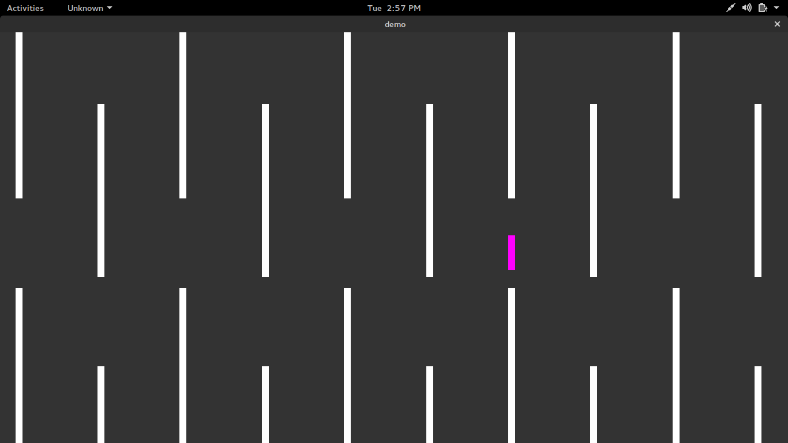

# MildHop

Made by: [maniotrix](https://github.com/maniotrix)

## Contributing

* Clone the repository, using

```
$ git clone https://github.com/maniotrix/MildHop.git
```

* Then open MildHop using "Unity3D"



## Usage

Download demo release for all platforms from [here](https://www.dropbox.com/sh/m4wgh562rv37hh7/AAAPxytoqkgi2UQD_YjEdnmOa?dl=0).

### Linux users:

<pre>
$ cd <i>path/to/demofile</i>
$ chmod 777 <i>demofile</i>
$ ./<i>demofile</i>
</pre>

### Windows users:

* Extract *demofile_data* and *demofile* in same folder
* Run *demofile.exe*
